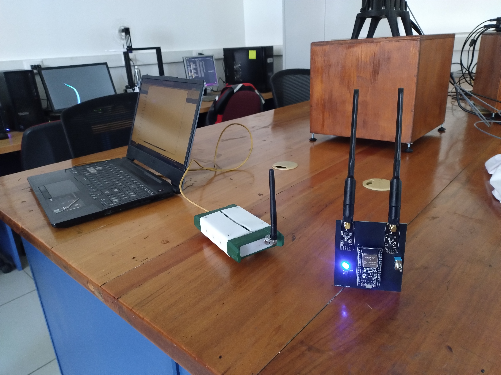
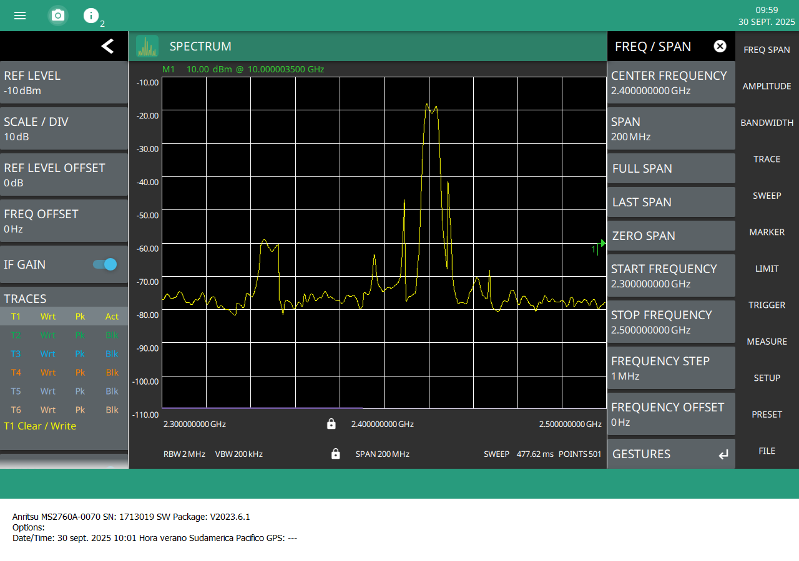
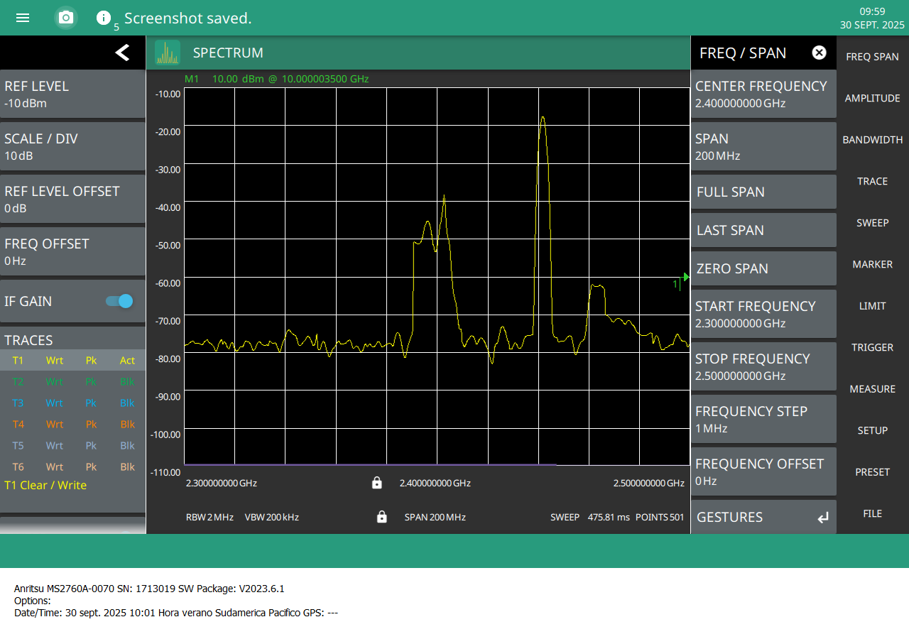
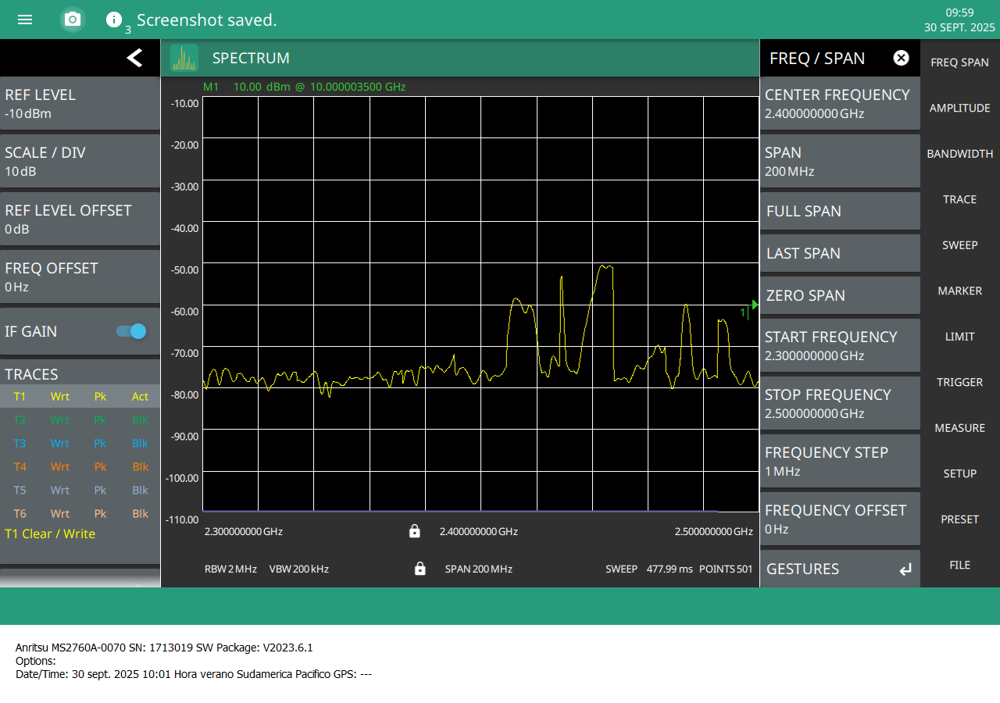
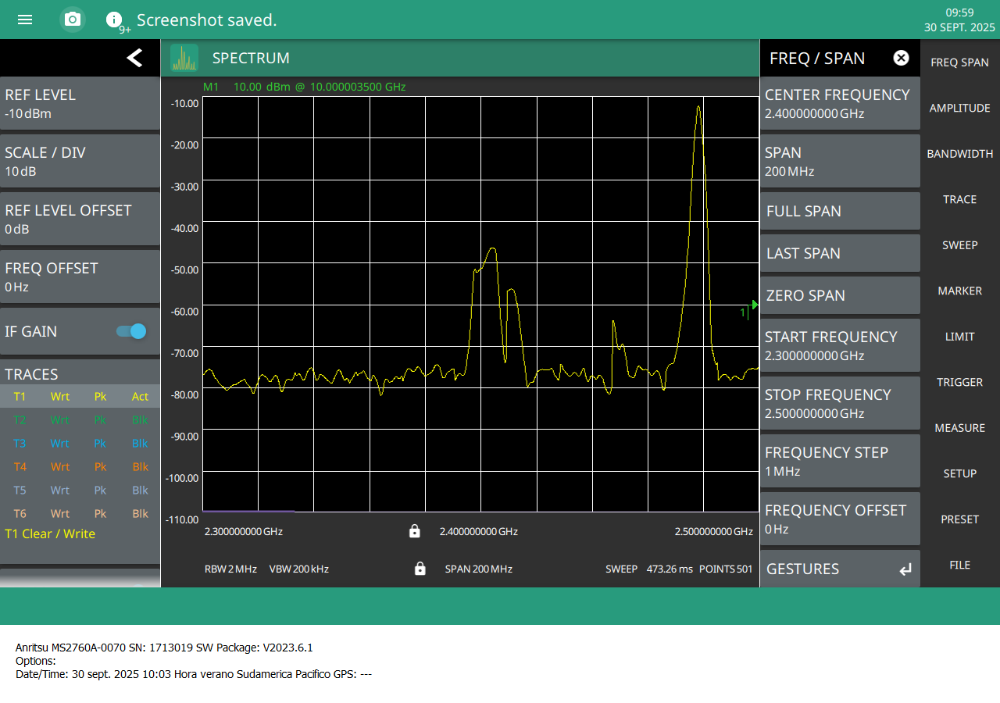
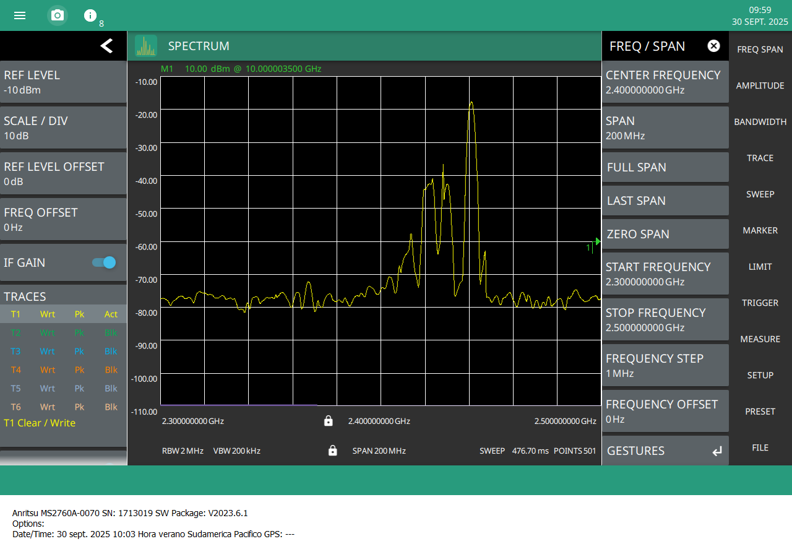
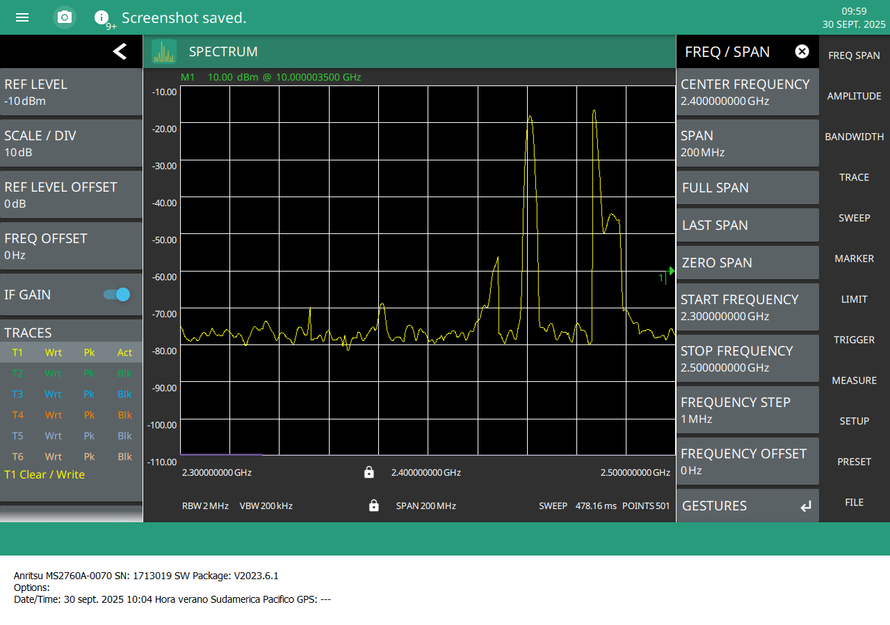
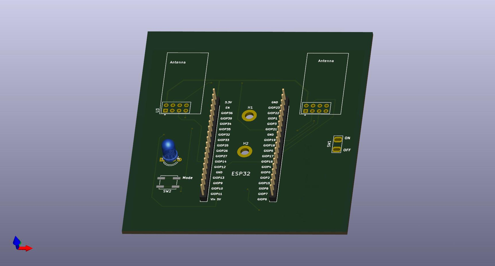
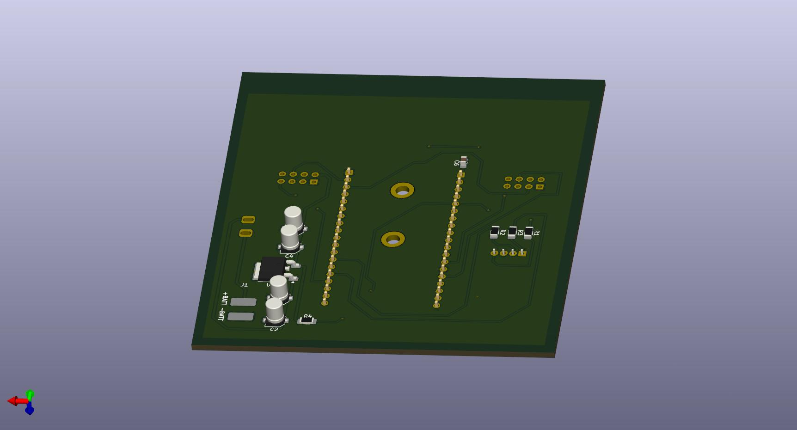

# 🔭 Bluetooth / BLE & RF Research Toolkit

> ⚠️ **Important:** This repository is strictly for **educational, analysis, and defensive research**.  
> It **does NOT** contain instructions or tools to jam, block, or interfere with radio communications.  
> Active interference (jamming, blocking) is illegal in many jurisdictions. Always obtain written authorization for any active tests and restrict them to isolated, shielded testbeds.

## 📖 Overview
This project — developed using **nRF24L01** modules and **ESP32** boards — gathers documentation and safe experiments for learning about Bluetooth/BLE and RF signaling in a legal, ethical way. The emphasis is on passive monitoring, not packet analysis, rather on protocol learning, and building controlled lab exercises for students and researchers.

Goals:
- Understand BLE and RF packet structures and behaviors.
- Perform **passive** captures and logging using ESP32 and nRF24L01 hardware in permitted environments.
- Create reproducible lab exercises to teach secure pairing, privacy addresses, and interference mitigation.
- Provide safe, legal guidance for setting up an isolated test environment.

> ⚠️ This repository will never provide instructions to build or operate jammers or active interference devices.

## 📂 Contents
- `/Hardware` →  schematic, PCB, Gerbers for ESP32 + nRF24L01.
- `/code_jmm` → C code for ESP32 (Arduino environment) and firmware file.
- `/docs` → photos setup.
- `/Experiment` → photos experiment, Anechoic Chamber and spectrum analyzer .

## 📊 Project Status
| Component                  | Status                      |
|---------------------------|-----------------------------|
| ESP32 passive scanner examples   | ✅ Completed               |
| nRF24L01 observation examples    | ✅ Completed             |
| Device assembly and electronic testing   | ✅ Completed               |
| Legal & ethics write-up   | ✅ Completed                |
| Spectrum captures         | ✅ Completed               |
| Measurement photos        | ✅ Completed            |
| Active interference research     | 🚫 Not included (forbidden)|

## 🧰 Hardware & Tools (recommended for passive analysis)
- **ESP32** development boards — used for BLE scanning and passive logging.
- **nRF24L01** modules — for hobby RF monitoring in permitted contexts (note: nRF24 uses its own non-Bluetooth RF stack).
- Shielded enclosure / Faraday box for any active experiments.

## 🔬 Measurement methodology (high-level)
- Measurements were taken using a calibrated **spectrum analyzer** and suitable antennas.  
- Experiments were performed in a controlled environment (shielded enclosure / isolated lab) and with the appropriate authorizations.  
- Captures include frequency averaged power spectral density (PSD).  
- **No** step-by-step instructions, hardware schematics, or firmware relating to emitters or jammers are included.

### 📸 Setup photos laboratory

<table>
  <tr>
    <td align="center">
       
      Anritsu MS2760A-0070
    </td>
    <td align="center">
       
      Anechoic chamber
    </td>
  </tr>
</table>

### 🔌 Power / Setup Overview

   
  Power / setup overview

### 📸 Measurement Photos — BLE

<table>
  <tr>
    <td align="center">
       
      BLE — Mode A
    </td>
    <td align="center">
       
      BLE — Mode B
    </td>
  </tr>
  <tr>
    <td align="center">
       
      BLE — Mode C
    </td>
    <td></td>
  </tr>
</table>

### 📸 Measurement Photos — Bluetooth

<table>
  <tr>
    <td align="center">
       
      Bluetooth — Mode A
    </td>
    <td align="center">
       
      Bluetooth — Mode B
    </td>
  </tr>
  <tr>
    <td align="center">
       
      Bluetooth — Mode C
    </td>
    <td></td>
  </tr>
</table>

### 📸 Measurement Photos — Bluetooth

<table>
  <tr>
    <td align="center">
       
      Bluetooth — Mode A
    </td>
    <td align="center">
       
      Bluetooth — Mode B
    </td>
  </tr>
  <tr>
    <td align="center">
       
      Bluetooth — Mode C
    </td>
    <td></td>
  </tr>
</table>

### 📈 Measurement Results (Summary)

- **Instrument:** Anritsu MS2760A-0070 spectrum analyzer.  
- **Captured data:** spectrum analyzer traces highlighting distortion in BLE/Bluetooth bands during device operation.  
- **Observed effects:** spectral broadening, spurious components and harmonics consistent with strong in-band emissions. These effects were recorded for documentation and analysis purposes only.  
- **Test modes:** the device was evaluated under several modes; during each mode the device performed sweeps across channels to observe frequency-dependent behavior. *(Operational parameters and control signals are intentionally omitted from this repository.)*  
- **Purpose:** these measurements inform detection/mitigation strategies and support responsible research into electromagnetic compatibility and spectrum monitoring.

### 📂Experiment Figures
Captured files and example figures are stored in the `/Experiment` folders:

- `docs/spectrum_analyzer.jpg` — photo of the Anritsu MS2760A-0070.  
- `docs/anechoic_chamber.jpg` — test environment photo.  

> ⚠️ Note: Raw operation logs or parameter sets that would enable reproduction of emissions are excluded from this repository.

### 🙏 Acknowledgments

Special thanks to the **[Laboratorio de Comunicaciones Inalámbricas — EIE PUCV](https://eie.pucv.cl/investigacion/lineas-de-investigacion-y-laboratorios/laboratorio-de-comunicaciones-inalambricas/)**  
for providing access to the **Airwave Lab**, the **Anechoic Chamber**, and the **Anritsu MS2760A-0070 Spectrum Analyzer** used in these experiments.

## 🖼️ 3D PCB Render (version 3)

<table>
  <tr>
    <td align="center">
       
      PCB render — front (v3)
    </td>
    <td align="center">
       
      PCB render — back (v3)
    </td>
  </tr>
</table>

## ⚡ Physical Prototype

<table>
  <tr>
    <td align="center">
       
      Device — front
    </td>
    <td align="center">
       
      Device — back
    </td>
  </tr>
</table>

## ⚖️ Legal & Ethical Guidelines
- Do not capture or analyze traffic from third-party devices without explicit permission.  
- Passive monitoring may still be subject to local laws — check your national telecom regulations.  
- Keep careful logs of tests, dates, and authorizations.  
- Perform any active tests only inside a shielded enclosure and with written consent.

# ⚖️ Legal & Regulatory References

This project is intended strictly for **educational purposes**.  
Operating or building radio interference devices without authorization is **illegal** in most jurisdictions.  
Below are links to relevant regulatory frameworks:

---

## 🇨🇱 Chile
- [Ley N° 18.168 — Ley General de Telecomunicaciones (BCN)](https://www.bcn.cl/leychile/navegar?idNorma=29582)  
- [Subsecretaría de Telecomunicaciones (SUBTEL) — Normas y Leyes](https://www.subtel.gob.cl/normas-y-leyes/)

---

## 🇺🇸 United States
- [47 CFR Part 15 — Radio Frequency Devices (eCFR)](https://www.ecfr.gov/current/title-47/chapter-I/subchapter-A/part-15)  
- [FCC — Rules & Regulations Overview](https://www.fcc.gov/rules-regulations)

---

## 🇪🇺 European Union
- [Directive (EU) 2018/1972 — European Electronic Communications Code (EECC)](https://eur-lex.europa.eu/legal-content/EN/TXT/?uri=CELEX%3A32018L1972)  
- [Directive 2014/53/EU — Radio Equipment Directive (RED)](https://eur-lex.europa.eu/legal-content/EN/TXT/?uri=CELEX%3A32014L0053)

---

## 🔒 Disclaimer
These references are provided for **informational purposes only**.  
- Always verify the current applicable law in your jurisdiction.  
- Obtain explicit **written authorization** before performing any active test involving RF emissions.  
- Limit all experiments to **controlled, shielded laboratory environments**.

## 📜 License
MIT License
